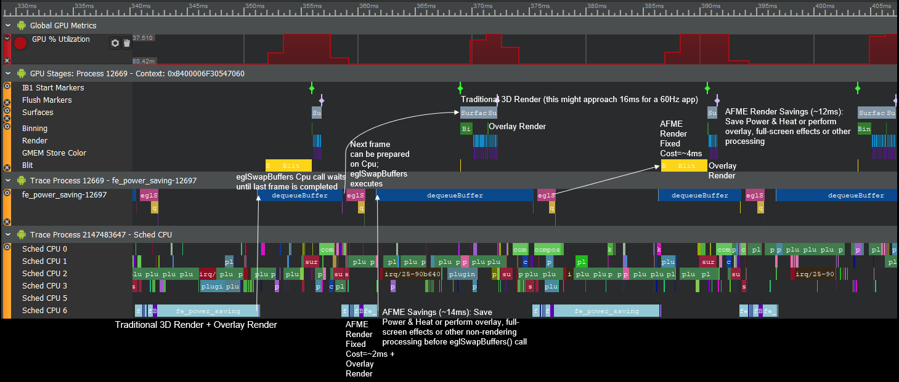

# Adreno™ GPU OpenGL ES Code Sample Framework

## Overview

This repository contains an OpenGL ES Framework for game and graphics developers to get up and running quickly for creating sample content and rapid prototyping. It is designed to be easy to build and have the basic building blocks needed for creating an Android APK with OpenGL ES functionality including an input system, as well as other helper utilities for loading resources, etc. This Framework has been extracted from and is a subset of the [Adreno GPU SDK](https://developer.qualcomm.com/software/adreno-gpu-sdk/tools).

## How to use this Framework

For an overview of the key features and functionality of this Framework please visit the [Framework Overview](OVERVIEW.md) page. Then, visit the [Hello Framework](samples/hello_fw) sample page to get up and running with building, deploying and extending a basic OpenGL ES application.

## Getting the Sample Framework

The framework uses submodules for both external code dependencies and to get the shared assets for the sample projects (GameSampleAssets).

`git clone --recursive https://github.com/quic/adreno-gpu-opengl-es-code-sample-framework`

...will clone the framework and its submodules.

Subsequent pulls can be done with

`git pull --recurse-submodules`

## Build

This OpenGL ES Framework is designed to be compiled straight into your application's executable.  For a simple example of building instructions, look at the [Hello Framework](samples/hello_fw) sample.

## Contributions
Thanks for your interest in contributing to the Adreno™ GPU OpenGL ES Code Sample Framework. Please read our [Contributions Page](CONTRIBUTING.md) for more information on contributing features or bug fixes. We look forward to your participation!

## License
Adreno™ GPU OpenGL ES Code Sample Framework is licensed under the BSD 3-clause “New” or “Revised” License. Check out the [LICENSE](LICENSE.md) for more details.

# Samples

## [Hello Framework](samples/hello_fw)

Hello Framework sample demonstrates the most basic usage of the Framework to produce a native OpenGL ES application.  It is designed to be a small and simple starting point for developers to expand on.

## [Hello GLTF](samples/hello_gltf)

Hello GLTF sample demonstrates the most basic usage the Framework and the GLTF file format to produce a native OpenGL ES application.  It is designed to be a small and simple starting point for developers to expand on.

## [Efficient MSAA](samples/msaa)

This sample shows how to use the [EXT_multisampled_render_to_texture](https://www.khronos.org/registry/OpenGL/extensions/EXT/EXT_multisampled_render_to_texture.txt) extension to utilize MSAA more efficiently on mobile platforms. By using this extension you can continue to use MSAA while avoiding a costly blit -- thus improving rendering performance.

## [Avoiding GMEM Loads](samples/avoid_gmem_loads)

This sample shows what a GMEMLoad is and why we want to minimize them. Removing unnecessary GMEMLoads can not only significantly improve the performance of your application but also reduce energy consumption.

## [Reducing GMEM Stores](samples/reduce_gmem_stores)

This sample shows what a GMEMStore is and why we want to minimize them. Removing unnecessary GMEM stores can not only significantly improve the performance of your application but also reduce energy consumption.

## [Shading Rate](samples/shading_rate)

This sample shows how to use the [QCOM_shading_rate](https://www.khronos.org/registry/OpenGL/extensions/QCOM/QCOM_shading_rate.txt) extension to modify the shading rate per drawcall. Using this technique effectively can greatly increase performance with little to no visual quality degradation.

## [Adaptive Frame Motion Extrapolation (AFME) Power Saving](samples/amfe_power_saving)

This sample shows how to use the [QCOM_frame_extrapolation](https://www.khronos.org/registry/OpenGL/extensions/QCOM/QCOM_frame_extrapolation.txt) extension -- or Adaptive Frame Motion Extrapolation (AFME) -- to dramatically reduce Cpu and Gpu workloads every other frame.  These Cpu and Gpu savings can be used to reduce power usage and heat generation, or to perform additional processing in some cases.

## [Pixel Motion Estimation](samples/motion_estimation)

This sample shows how to use the [QCOM_motion_estimation](https://www.khronos.org/registry/OpenGL/extensions/QCOM/QCOM_motion_estimation.txt) extension to generate a motion vector texture from a reference image and a target image for applications like frame extrapolation, compression, object tracking, motion-blur, and others.