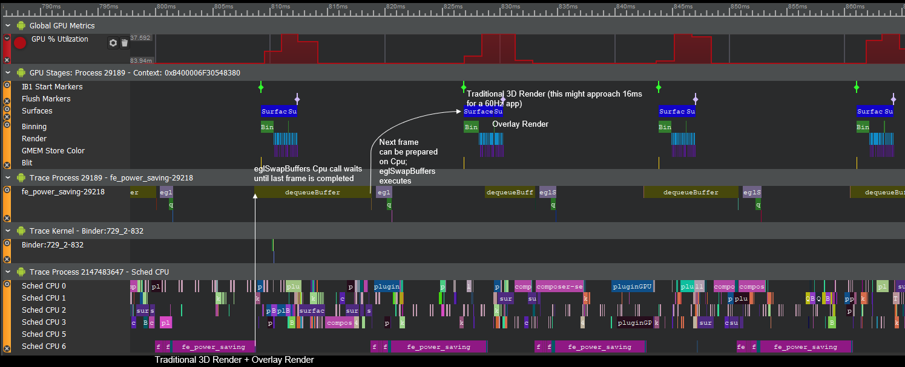

# Adaptive Frame Motion Extrapolation Power Saving Sample

## Overview

Adaptive Frame Motion Extrapolation (AFME) power saving sample demonstrates how to dramatically reduce Cpu and Gpu workloads every other frame.  These Cpu and Gpu savings can be used to reduce power usage and heat generation, or to perform additional Gpu processing or Cpu processing (provided that Cpu processing occurs before the call to eglSwapBuffers(), which blocks until the presentation engine is finished with the previous frame).  Depending on content, AFME generates few to no noticeable artifacts.

For instructions on how to build this sample navigate to the [build](#build) section.

## Evaluating Behavior and Performance with Snapdragon Profiler

Tapping the screen switches from rendering every frame as usual to rendering every other frame, and using AFME to generate every other frame from the last two traditionally rendered frames.

Snapdragon profiler shows the differences between each approach (timings were measured on an 8350):

Traditional Rendering:



AFME Rendering:


## Implementation Example

The core of the implementation is rendering two frames traditionally, and then alternating between displaying a frame extrapolated from the last two traditionally rendered frames, and displaying a traditional frame:
```
    if (m_extrapolateThisFrame)
    {
        m_glExtrapolateTex2DQCOM(
            m_offscreenFramebufferTexturesColor[m_framesTraditionalRendered % 2],
            m_offscreenFramebufferTexturesColor[m_framesTraditionalRendered % 2 ? 0 : 1],
            m_extrapolatedTexture,
            .5f);//extrapolate half the "distance" between these two frames

        glBindFramebuffer(GL_DRAW_FRAMEBUFFER, 0);        
        ClearFast(GL_COLOR_BUFFER_BIT);
        FrmBlitAvoidGMemLoads(m_extrapolatedTexture, m_fullscreenCopyShader);
        
        //...
    }
    else
    {
        //...
        
        //render to texture so it's saved for frame extrapolation
        const size_t framesTraditionalIndex = m_framesTraditionalRendered % 2;
        const GLuint savedBackbufferFramebufferHandle = m_offscreenFramebuffers[framesTraditionalIndex];
        glBindFramebuffer(GL_DRAW_FRAMEBUFFER, savedBackbufferFramebufferHandle);       
        RenderTraditional(timeSinceLastTraditionalRender);
        
        //...
        
        //blit offscreen texture to backbuffer
        glBindFramebuffer(GL_DRAW_FRAMEBUFFER, 0);
        ClearFast(GL_COLOR_BUFFER_BIT);
        FrmBlitAvoidGMemLoads(m_offscreenFramebufferTexturesColor[framesTraditionalIndex], m_fullscreenCopyShader);
        ++m_framesTraditionalRendered;
    }
```

These frames might look like (from first to last order of display):

Traditional Render 0


Traditional Render 1


Extrapolated Render 0


## Build

### Dependencies

The following dependencies must be installed and the appropriate locations should be referenced in the `PATH` environment variable.

* Android SDK
* Andorid NDK
* Gradle
* CMake
* Android Studio

Before building any sample, run 03_BuildTools.bat at the root of the repository to ensure that all executables any sample might need are built.

At this point, building this sample APK is as simple as navigating to the `build\android` folder and on a command prompt using the following gradle command:

```

$ gradlew assembleRelease

```

Building a slightly-slower executable with asserts can be done with:

```

$ gradlew assembleDebug

```


This sample can also be easily imported to Android Studio and be used within the Android Studio ecosystem -- including building, deploying, and native code debugging.

To do this, open Android Studio and go to `File->New->Import Project...` and select the `build\android` folder as the source for the import. This will load the gradle configuration, at which point the sample can be used within Android Studio.