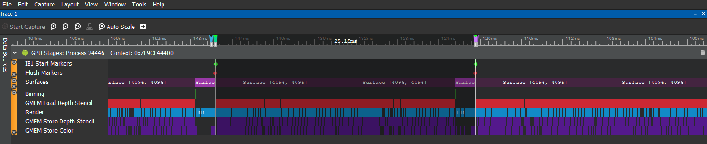

# Avoiding GMEM Loads (Unresolves)


This sample shows what a GMEMLoad is and why we need to avoid them. Removing unnecessary GMEMLoads can not only significantly improve the performance of your application but also reduce energy consumption.

For instructions on how to build this sample navigate to the [build](#build) section. To use the sample toggle the clear all/buffer by clicking the screen

Note: Newer driver may try to optimize when detecting potential GMEM load. you might not see the GMEMload on recent drivers.

## What is a GMEM Load?

Graphics Memory (GMEM) is a dedicated fast memory on the GPU. It is fast and small. The physical size of GMEM varies based on the GPU and is about 1mb depending on the device. For tiled rendering architecture, it fits a tile's color attachments, depth and stencil attachments. The need to load data from system memory to GMEM is called a GMEM Load or Unresolve. Please see the documentation in [Tiling Architecture](https://developer.qualcomm.com/docs/adreno-gpu/developer-guide/gpu/overview.html#tile-based-rendering).

## Why we need to avoid them?

GMEM Load increase the traffic between system memory and GPU, it usually has negative impact on performance, more importantly it could increase power consumption.

## How to Identify GMEM Loads?

Use Snapdragon Profiler. Please see the tools page for Snapdragon Profiler.

From the screenshots below GPU time is 18.24ms without GMEM Loads. The frame time increases to 25.15 with GMEM Loads, 37% difference.
 

This screenshot is taken when there is only color buffer cleared at the beginning of each FBO



This screenshot is taken when there is clear all at the beginning of each FBO


## Build

### Dependencies

The following dependencies must be installed and the appropriate locations should be referenced in the `PATH` environment variable.

* Android SDK
* Andorid NDK
* Gradle
* CMake
* Android Studio

Once the dependencies are installed, building this sample APK is as simple as navigating to the `build\android` folder and on a command prompt using the following gradle command:

```

$ gradle assembleDebug

```

This sample can also be easily imported to Android Studio and be used within the Android Studio ecosystem including building, deploying, and native code debugging.

To do this, open Android Studio and go to `File->New->Import Project...` and select the `build\android` folder as the source for the import. This will load up the gradle configuration and once finalized, the sample can be used within Android Studio.
