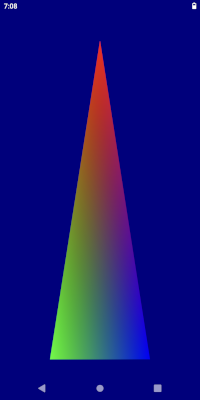

# Hello-Framework Sample



## Overview

Hello Framework sample demonstrates the most basic usage of the Framework to produce a native OpenGL ES application and it is designed to be small and simple and meant as a starting point for developers to expand its functionality.

It is recommended that this sample is used as a starting point for other applications using this Framework. To do so, this folder can be copied to a desired location and the respective changes to point the source and include files to the Framework `src` and `include` folders are addressed. For simplicity, the folder of the new sample can be created alongside the `hello-fw` sample within the `samples` folder. This way, no additional modifications are required in any configuration file to build it out of the box.

## Building

### Dependencies

The following dependencies must be installed and the appropriate locations should be referenced in the `PATH` environment variable.

* Android SDK
* Andorid NDK
* Gradle
* CMake
* Android Studio

Once the dependencies are installed, building this sample APK is as simple as navigating to the `build\android` folder and on a command prompt using the following gradle command:

```

$ gradle assembleDebug

```

This sample can also be easily imported to Android Studio and be used within the Android Studio ecosystem including building, deploying, and native code debugging.

To do this, open Android Studio and go to `File->New->Import Project...` and select the `hellow-fw\build\android` folder as the source for the import. This will load up the gradle configuration and once finalized, the sample can be used within Android Studio.
