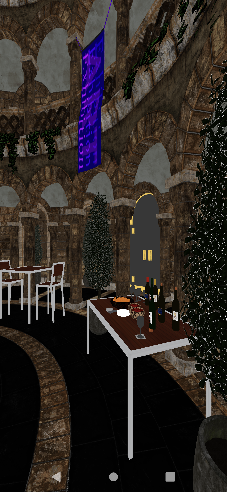

# Hello GLTF Sample

## Overview

Hello GLTF sample demonstrates the most basic usage of reading GLTF-encoded static geometry with materials into the Adreno datastructures and rendering them:



## Implementation Example
The entrypoint to the gltf-loading code is:
```
    const bool gltfLoadResult = Adreno::FrmLoadGLTFModelsFromTextFile(
        &adrenoModels,
        &m_textureFilepaths, 
        &m_meshesSortedByMaterialId, 
        "Meshes/Museum.gltf",
        m_baseColorDefault_MaterialId);
```

## Build

### Dependencies

The following dependencies must be installed and the appropriate locations should be referenced in the `PATH` environment variable.

* Android SDK
* Andorid NDK
* Gradle
* CMake
* Android Studio

Before building any sample, run 03_BuildTools.bat at the root of the repository to ensure that all executables any sample might need are built.

At this point, building this sample APK is as simple as navigating to the `build\android` folder and on a command prompt using the following gradle command:

```

$ gradlew assembleRelease

```

Building a slightly-slower executable with asserts can be done with:

```

$ gradlew assembleDebug

```

This sample can also be easily imported to Android Studio and be used within the Android Studio ecosystem -- including building, deploying, and native code debugging.

To do this, open Android Studio and go to `File->New->Import Project...` and select the `build\android` folder as the source for the import. This will load the gradle configuration, at which point the sample can be used within Android Studio.
