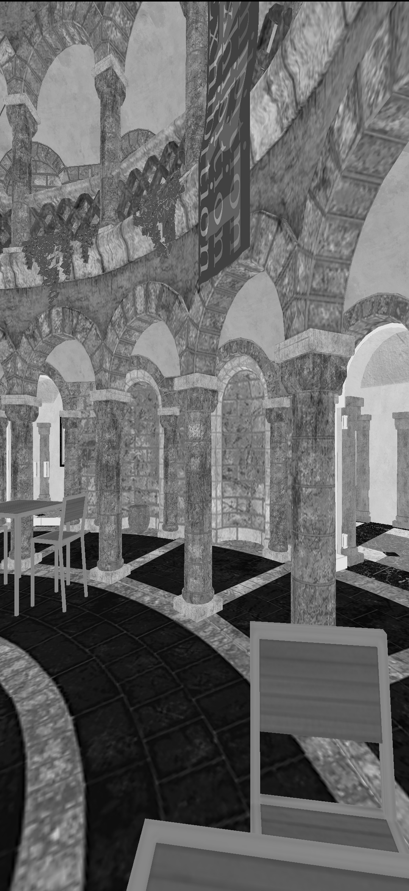
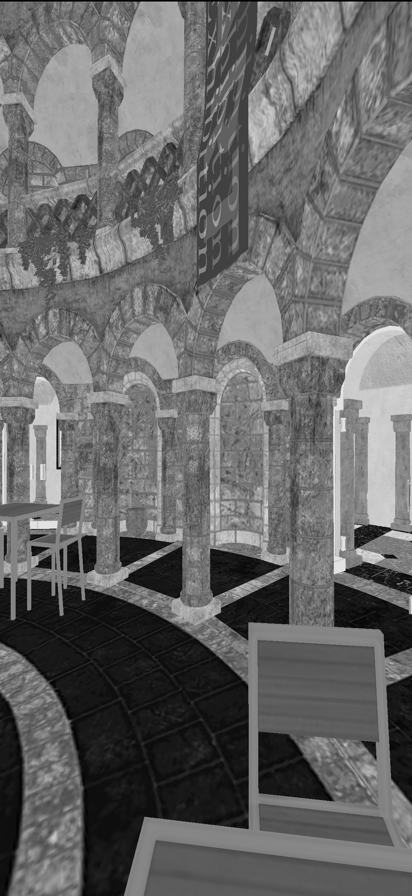
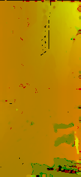

# Pixel Motion Estimation Sample

## Overview

Pixel Motion Estimation sample demonstrates how to generate a motion vector texture from a reference image and a target image for applications like frame extrapolation, compression, object tracking, motion-blur, and others.

More information can be found at:
https://www.khronos.org/registry/OpenGL/extensions/QCOM/QCOM_motion_estimation.txt

For instructions on how to build this sample navigate to the [build](#build) section.

Tapping the screen switches from rendering the (upscaled) motion vector texture to the traditionally rendered scene that generates said motion vector texture.

## Implementation Example

The core of the implementation relies on rendering a (typically lower resolution) luminance texture for every traditionally rendered frame.  Motion vectors are generated from the last two luminance textures.

```
//startup
    //ask for the motion vector resolution -- in this example, it returns 8x8, and ensure render target is sized to cleanly 
    //accommodate it
    const GLenum MOTION_ESTIMATION_SEARCH_BLOCK_X_QCOM = 0x8C90;
    const GLenum MOTION_ESTIMATION_SEARCH_BLOCK_Y_QCOM = 0x8C91;

    glGetIntegerv(MOTION_ESTIMATION_SEARCH_BLOCK_X_QCOM, &m_motionEstimationSearchBlockX);
    glGetIntegerv(MOTION_ESTIMATION_SEARCH_BLOCK_Y_QCOM, &m_motionEstimationSearchBlockY);
    
    m_offscreenRenderTexturesWidth = RoundUpToNearestMultiple(eglSurfaceWidth, m_motionEstimationSearchBlockX);
    m_offscreenRenderTexturesHeight = RoundUpToNearestMultiple(eglSurfaceHeight, m_motionEstimationSearchBlockY);
   
   //...
    
    //create luminance textures
    for (size_t i = 0; i < luminanceTextureResourcesNum; ++i)
    {
        auto& luminanceTextureColor = m_luminanceTextures[i];
        FrmCreateTexture(
            &luminanceTextureColor,
            GL_R8,
            m_offscreenRenderTexturesWidth,
            m_offscreenRenderTexturesHeight);
        FrmCreateAndBindFramebufferToTexture(&m_luminanceFramebuffers[i], luminanceTextureColor);
    }
   
//...

//render loop
    //render to offscreen texture first
    glBindFramebuffer(GL_DRAW_FRAMEBUFFER, m_offscreenFramebuffer);
    RenderTraditional(timeSinceLastRender);

    //blit offscreen texture to backbuffer
    glBindFramebuffer(GL_DRAW_FRAMEBUFFER, 0);
    ClearFast(GL_COLOR_BUFFER_BIT);
    FrmBlitAvoidGMemLoads(m_offscreenFramebufferTextureColor, m_fullscreenCopyShader);

    //generate luminance texture from offscreen buffer
    const size_t framesIndex = m_framesRendered % 2;
    glBindFramebuffer(GL_DRAW_FRAMEBUFFER, m_luminanceFramebuffers[framesIndex]);
    FrmBlitAvoidGMemLoads(m_offscreenFramebufferTextureColor, m_rgbaToLuminanceShader);
    
    //...

    if(m_framesRendered > 0)
    {
        m_glTexEstimateMotionQCOM(  m_luminanceTextures[framesIndex ? 0 : 1],
                                    m_luminanceTextures[framesIndex],
                                    m_motionVectorsTexture);

        glBindFramebuffer(GL_DRAW_FRAMEBUFFER, 0);
        FrmBlitAvoidGMemLoads(m_motionVectorsTexture, m_fullscreenCopyShader);
    }
```

These frames might look like:

Render 0


Render 1


Which produce:

Luminance Buffer 0


Luminance Buffer 1


Which in turn produce:
m_motionVectorsTexture 0:



In this example each motion vector pixel corresponds to an 8x8 block of pixels.  The Red channel contains the screenspace X vector value, and the Green channel contains the screenspace Y vector value.  (The Blue and Alpha channels are unused).

## Build

### Dependencies

The following dependencies must be installed and the appropriate locations should be referenced in the `PATH` environment variable.

* Android SDK
* Andorid NDK
* Gradle
* CMake
* Android Studio

Before building any sample, run 03_BuildTools.bat at the root of the repository to ensure that all executables any sample might need are built.

At this point, building this sample APK is as simple as navigating to the `build\android` folder and on a command prompt using the following gradle command:

```

$ gradlew assembleRelease

```

Building a slightly-slower executable with asserts can be done with:

```

$ gradlew assembleDebug

```


This sample can also be easily imported to Android Studio and be used within the Android Studio ecosystem -- including building, deploying, and native code debugging.

To do this, open Android Studio and go to `File->New->Import Project...` and select the `build\android` folder as the source for the import. This will load the gradle configuration, at which point the sample can be used within Android Studio.