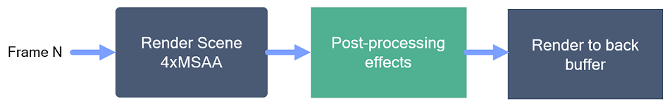
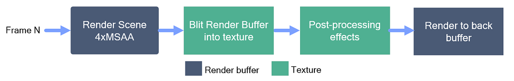
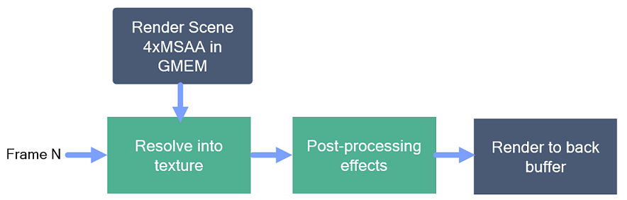
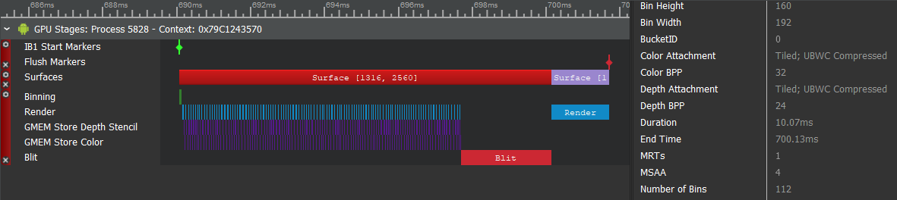
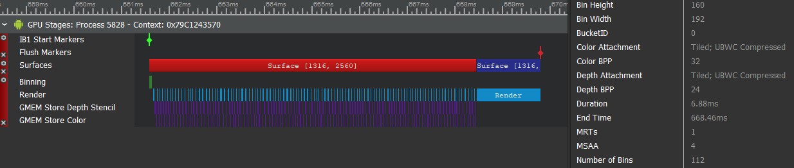

# Improving MSAA Performance

Using an anti-aliasing technique to reduce the artifacts of rasterization can be an effective way to improve the visual quality of a game. In general, one could classify techiques to be either software or hardware based. Due to the nature of the tiling architecture pipeline of mobile platforms, software based techniques can be prohibitively expensive in real world scenarios. In the contrary, due to how tiling architectures operate at a per tile basis, MSAA at the hardware level can be very effective and more power efficient. In order to take full advantage of this, an OpenGL ES extension is required to 'hint' the GPU as it is explained in the following sections.

This sample shows how to use the [EXT_multisampled_render_to_texture](https://www.khronos.org/registry/OpenGL/extensions/EXT/EXT_multisampled_render_to_texture.txt) extension to utilize MSAA more efficiently on mobile platforms. By using this extension you will be able to continue to use MSAA and avoid a costly blit that would be necessary without it thus improving rendering performance.

For instructions on how to build this sample navigate to the [build](#build) section.

## Problem Statement

To exemplify the usage of this extension, the sample sets up a simple post processing pipeline as shown in the image below:



Here, the scene is rendered on a 4xMSAA target and a post processing pipeline is applied to the output. To simplify this example, only one post FX is implemented in the sample with a simple vignetting shader. Ultimately the result is rendered to the back buffer. In order to accomplish this in OpenGL ES our first instinct is to create a pipeline as follows:



This creates a 4xMSAA Render target which needs to be blit into a single sample FBO to feed into the post processing pipeline. This workflow is inefficient for tiling architectures because the full 4xMSAA target needs to be resolved (GMEM Stored) and then blitted. Since the 4xMSAA target is only needed while rendering the scene, its full 4x content is not needed afterwards. [EXT_multisampled_render_to_texture](https://www.khronos.org/registry/OpenGL/extensions/EXT/EXT_multisampled_render_to_texture.txt) allows us to create a 4xMSAA target that for scene rendering purposes it behaves the same as the example above on a per-tile basis, but content is resolved and filtered onto a single sample render target avoiding the blit altogether as shown below:



## Evaluating Behavior and Performance with Snapdragon Profiler

Using tools like [Snapdragon Profiler](https://developer.qualcomm.com/software/snapdragon-profiler) are essential to understand what is happening 'under the hood' while rendering to a mobile device. As shown in the figures below, we can see how Snapdragon Profiler 'Rendering Stages' metric allows us to visualize stage (Binning, GMEM Load, GMEM Store, Render, etc.) time information per surface as well as the surface properties.

### Not Optimized


### Optimized


Some important highlights:
* Optimized version does not perform a blit operation. This blit takes ~2.5ms in an Adreno 530 device.
* Rendering of scene on both versions is roughly equivalent as both use the same amount of tiles since they both render to a 4xMSAA target in GMEM.
* Performance improvement in this configuration resulted in ~3ms difference.
* Even though this sample is not GPU bound, we can get accurate GPU timing information using [Snapdragon Profiler](https://developer.qualcomm.com/software/snapdragon-profiler).
* Side-note: We do not see any GMEM Load operations as we cleared the FBO's before use (see 'Avoid GMEM Loads' sample) and we do not resolve the depth buffer improving performance (see 'Optimizing GMEM Stores' sample).

## Implementation Details

All the code described here lives within the `Sample.cpp` file. The key functions within the sample to looc at are `CreateFBO()` and `Render()`. 

The sample provides one `CreateFBO()` function that takes in an `isOptimized` parameter that showcases the minimal amount of changes needed to port a standard pipeline as described above to use the OpenGL ES extension instead. The key difference here is the ability to setup normal texture FBO targets as opposed to render buffers and constructing the FBO using [glFramebufferTexture2DMultisampleEXT](https://www.khronos.org/registry/OpenGL/extensions/EXT/EXT_multisampled_render_to_texture.txt) API which is the key part to hint the GPU on how to setup the MSAA FBO.

The `Render()` function exemplifies the difference in pipeline execution and showcases how the optimized path does not require the [glBlitFramebuffer](https://www.khronos.org/registry/OpenGL-Refpages/es3.0/html/glBlitFramebuffer.xhtml) as well as the intermediate FBO to 'prepare' the results for the post effects pipeline.

## Build

### Dependencies

The following dependencies must be installed and the appropriate locations should be referenced in the `PATH` environment variable.

* Android SDK
* Andorid NDK
* Gradle
* CMake
* Android Studio

Once the dependencies are installed, building this sample APK is as simple as navigating to the `build\android` folder and on a command prompt using the following gradle command:

```

$ gradle assembleDebug

```

This sample can also be easily imported to Android Studio and be used within the Android Studio ecosystem including building, deploying, and native code debugging.

To do this, open Android Studio and go to `File->New->Import Project...` and select the `build\android` folder as the source for the import. This will load up the gradle configuration and once finalized, the sample can be used within Android Studio.
