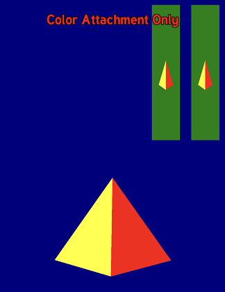
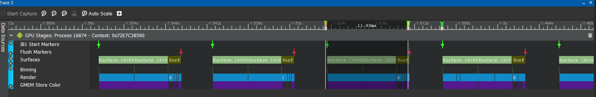
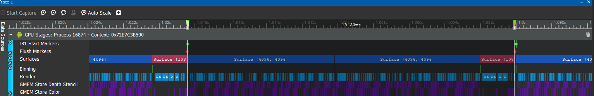

# Reducing GMEM Stores (Resolves)



This sample shows what a GMEMStore event is and why we need to minimize them. Removing unnecessary GMEM stores can not only significantly improve the performance of your application, but also reduce energy consumption.

For instructions on how to build this sample navigate to the [build](#build) section. To use this sample, toggle the all/color attachments by tapping the screen.

Note: Newer drivers may optimize away unnecessary GMEM Loads, so you might not see them on recent drivers.

## What is a GMEM Store?

Graphics Memory (GMEM) is small, fast memory dedicated to the GPU.  The physical size of GMEM varies based on the GPU and is on the order of megabytes, depending on the device. In the device's tiled memory architecture, it contains a tile's color, depth and stencil attachments. Moving data from GMEM to system memory is called a GMEM Store or Resolve. For more, see [Tiling Architecture](https://developer.qualcomm.com/docs/adreno-gpu/developer-guide/gpu/overview.html#tile-based-rendering).

## Why we need to minimize GMEM Store events

GMEM Stores increase the traffic between system memory and GPU, and usually negatively impacts performance, while increasing power consumption.

## How do we identify GMEM Stores?

Use Snapdragon Profiler. Please see https://developer.qualcomm.com/software/snapdragon-profiler

From the screenshots below GPU time is 18.33ms with GMEM depth stencil store. The frame time decreases to 11.93 without GMEM Depth stencil stores -- a 50% difference.
 

Here there is no depth/stencil attachment for the FBO, eliminating GMEM Store events. The depth/stencil attachments are unnecessary, since this FBO's color attachment is used as a texture in the following rendering.



Here there are both depth and stencil attachments for the FBO. The depth and stencil attachment is useless for the rendering, but still contributes GMEM store events.



## Build

### Dependencies

The following dependencies must be installed and the appropriate locations should be referenced in the `PATH` environment variable.

* Android SDK
* Andorid NDK
* Gradle
* CMake
* Android Studio

Before building any sample, run 03_BuildTools.bat at the root of the repository to ensure that all executables any sample might need are built.

Once the dependencies are installed, building this sample APK is as simple as navigating to the `build\android` folder and on a command prompt using the following gradle command:

```

$ gradlew assembleDebug

```

This sample can also be easily imported to Android Studio and be used within the Android Studio ecosystem -- including building, deploying, and native code debugging.

To do this, open Android Studio and go to `File->New->Import Project...` and select the `build\android` folder as the source for the import. This will load the gradle configuration, at which point the sample can be used within Android Studio.
