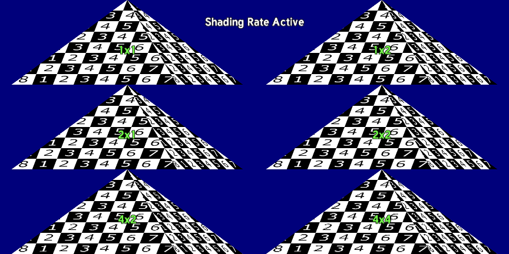

# Shading Rate



This sample shows how to use the [QCOM_shading_rate](https://www.khronos.org/registry/OpenGL/extensions/QCOM/QCOM_shading_rate.txt) extension to modify the shading rate per drawcall. Using this technique effectively can greatly increase performance with little to no visual quality degradation.

For instructions on how to build this sample navigate to the [build](#build) section.

## What is Shading Rate?

When the GPU renders and rasterizes objects into a surface, it does so at a rate of one sample per pixel (assuming no multi-sampling is used -- although shading rate can be applied to multi-sampled surfaces as well). This extension gives developers the ability to modify this shading rate to be coarser than a pixel. The supported resolutions of this extension are:

* GL_SHADING_RATE_1X1_PIXELS_QCOM (Default shading)
* GL_SHADING_RATE_1X2_PIXELS_QCOM
* GL_SHADING_RATE_2X1_PIXELS_QCOM
* GL_SHADING_RATE_2X2_PIXELS_QCOM
* GL_SHADING_RATE_4X2_PIXELS_QCOM
* GL_SHADING_RATE_4X4_PIXELS_QCOM

If, for example, GL_SHADING_RATE_4X4_PIXELS_QCOM is used, then the result of a single shading operation will be used to color an area of 4x4 pixels.

## Effective ways to modify shading rate

This extension can improve performance on heavily fragment bound drawcalls. As expected from reducing the shading rate, this can impact visual quality if used inappropriately. Research on optimization via modifying shading rate is active and several relevant articles and talks can be found online. Some examples that can benefit from this technique are:

* Surfaces where the color variance is small
* Areas on a surface that do not require pixel accuracy for shading, like color targets that will be downscaled, or if motion blur is enabled and there are significant velocity field changes, or if depth of field is used such that there are areas outside of the focus point that will be blurred
* Effects like motion volumetric rendering where the high-frequency-detail portion of the scene is processed at full shading rate and the lower-frequency-detail portion of the scene is processed at a reduced shading rate

On mobile devices, performance and power are tightly coupled. Improving performance using shading rate can also reduce power consumption and the thermal profile of your game, increasing user play time.

## Build

### Dependencies

The following dependencies must be installed and the appropriate locations should be referenced in the `PATH` environment variable.

* Android SDK
* Andorid NDK
* Gradle
* CMake
* Android Studio

Before building any sample, run 03_BuildTools.bat at the root of the repository to ensure that all executables any sample might need are built.

Once the dependencies are installed, building this sample APK is as simple as navigating to the `build\android` folder and on a command prompt using the following gradle command:

```

$ gradlew assembleDebug

```

This sample can also be easily imported to Android Studio and be used within the Android Studio ecosystem -- including building, deploying, and native code debugging.

To do this, open Android Studio and go to `File->New->Import Project...` and select the `build\android` folder as the source for the import. This will load the gradle configuration, at which point the sample can be used within Android Studio.
